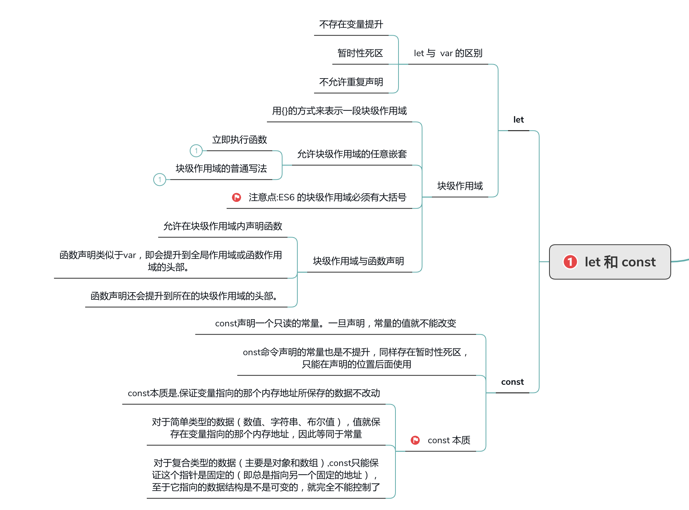

## 一、let 和 const 命令

### let 和 const
ES6中提供了`let`和 `const`关键字声明变量，这样做的好处是：
- 不再需要立即执行的函数表达式
  - 在ES5中为了不污染全局作用域，我们会构建一个立即执行的函数表达式。在ES6中我们只需要（{}），然后使用 const 或者 let 代替 var 来达到同样的效果
- 循环体中的闭包不再有问题
  - 在ES5中，如果循环体内有一个闭包，访问闭包外的变量会有问题，在ES6中可以使用let避免
- 防止重复声明变量
  - ES6 不允许在同一个作用域内用 let 或 const 重复声明同名变量
- 暂时性死区
  - 在代码块内，使用let命令声明变量之前，该变量都是不可用的
- 不绑定全局作用域
  - 当在全局作用域中使用 let 声明的时候，不会创建一个新的全局变量作为全局对象的属性。
  ```js
  let value = 1;
  console.log(window.value); // undefined
  ```


### 块级作用域
在ES6之前我们只有全局作用域和函数作用域，这么做产生的问题有：
- 内层变量覆盖外层变量
- 变量泄露，成为全局变量
为了加强对变量生命周期的控制，ES6引入了块级作用域，它存在于：
- 函数内部
- 块中(字符 { 和 } 之间的区域)

## 二、Symbol 类型
**Symbol是 ES6 引入的一种新的原始数据类型，表示独一无二的值。**
```js
let s = Symbol();

typeof s
// "symbol"
```

特性：
- **1、Symbol函数前不能使用new命令，否则会报错，这是因为生成的 Symbol 是一个原始类型的值，不是对象。**
- **2、Symbol函数的参数只是表示对当前 Symbol 值的描述，因此相同参数的Symbol函数的返回值是不相等的**
```js
// 没有参数的情况
let s1 = Symbol();
let s2 = Symbol();

s1 === s2 // false

// 有参数的情况
let s1 = Symbol('foo');
let s2 = Symbol('foo');

s1 === s2 // false
```
 - **3、如果 Symbol 的参数是一个对象，就会调用该对象的 toString 方法，将其转为字符串，然后才生成一个 Symbol 值**
 - **4、Symbol 值不能与其他类型的值进行运算，会报错。**
```js
let sym = Symbol('My symbol');

"your symbol is " + sym
// TypeError: can't convert symbol to string
`your symbol is ${sym}`
// TypeError: can't convert symbol to string
```
 - **5、Symbol 属性的不可枚举性，不会被 for...in、for...of、Object.keys()、Object.getOwnPropertyNames()、JSON.stringify() 等枚举**
```js
let person = {
    name: 'xch',
    [Symbol('age')]: 30,
}
for (let x in person) {
    console.log(x)  // 'name'
}
Object.keys(person)  // ['name']
Object.getOwnPropertyNames(person)  // ['name']
JSON.stringify(person)  // '{"name":"xch"}'

```
 - **6、Symbol.for()，Symbol.keyFor()**
```js
let s1 = Symbol.for('foo');
let s2 = Symbol.for('foo');
let s3 = Symbol('bar');
let s4 = Symbol('bar');

s1 === s2 // true
s3 === s4 // false

console.log(Symbol.keyFor(s1)); // "foo"
console.log(Symbol.keyFor(s3)); // undefined

```
`Symbol.for()`不会每次调用就返回一个新的 `Symbol` 类型的值，而是会先检查给定的key是否已经存在，如果不存在才会新建一个值，由于`Symbol()`写法没有登记机制，所以每次调用都会返回一个不同的值。

### 常见用法：
1. **用于定义一组常量，保证这组常量的值都是不相等的。**
```js
const levels = {
  DEBUG: Symbol('debug'),
  INFO: Symbol('info'),
  WARN: Symbol('warn')
};
console.log(levels.DEBUG, 'debug message');
console.log(levels.INFO, 'info message');
```

2. **Symbol 值作为对象属性名，防止属性名冲突**
```js
let mySymbol = Symbol();
let a = {
  [mySymbol]: 'Hello!'
};
// Symbol 值作为对象属性名时，不能用点运算符
a.mySymbol = 'Hello!';
a[mySymbol] // "Hello!"
```

### 如何模拟实现 Symbol 的这些特性？
[深入理解](https://github.com/mqyqingfeng/Blog/issues/87)