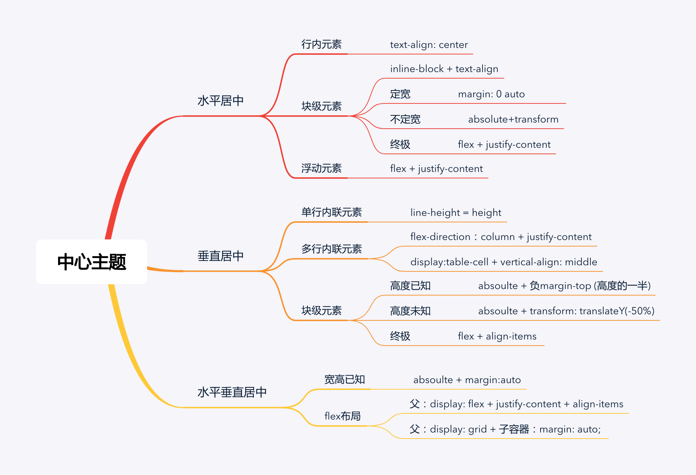

# 如何居中一个元素?


## 一、水平居中
1. 行内元素水平居中
> 如果该行内元素是在包裹在块级元素里面的话，可以在块级元素上使用 `text-align: center;`实现居中，当然如果块级元素内部还是块级元素的话可以让内部的块级元素先转为行内块元素

```js
<div class="parent">
  <div class="child">Demo</div>
</div>
<style>
  .parent{
    text-align:center;  
  }
  .child {
    display: inline-block;
  }
</style>
```

2. 块级元素的水平居中
  - 2.1 如果块级元素的宽能确定的话，将该块级元素左右外边距margin-left和margin-right设置为auto
```js
<div class="parent">
  <div class="child">Demo</div>
</div>
<style>
  .parent{
    text-align:center;  
  }
  .child {
    width: 100px
    margin: 0 auto
  }
</style>
```
  - 2.2 如果块级元素的宽根据内容而定的话，可以使用`absolute+transform`
```js
<div class="parent">
  <div class="child">Demo</div>
</div>
<style>
  .child {
    position:absolute;
    left:50%;
    transform:translateX(-50%);
  }
  .parent {
    position:relative;
  }
</style>
```
> 注意: `transform`属于css3内容，兼容性存在一定问题，高版本浏览器需要添加一些前缀。

  - 2.3 使用`flex`中的`justify-content`
```js
<div class="parent">
  <div class="child">Demo</div>
</div>
<style>
  .parent {
    display: flex;
    justify-content:center;
  }
</style>
```

3. 浮动元素水平居中
- 3.1 对于定宽的浮动元素，通过子元素设置`relative + 负margin`
```js
.child {
   position:relative;
   left:50%;
   margin-left:-250px;
}
<div class="parent">
  <span class="child" style="float: left;width: 500px;">我是要居中的浮动元素</span>
</div>
```
- 3.2 对于不定宽的浮动元素，父子容器都用相对定位
```js
<div class="box">
    <p>我是浮动的</p>
    <p>我也是居中的</p>
</div>
.box{
    float:left;
    position:relative;
    left:50%;
}
p{
    float:left;
    position:relative;
    right:50%;
}
```
- 3.3 通用方法(不管是定宽还是不定宽)：flex布局
```js
.parent {
    display:flex;
    justify-content:center;
}
.chlid{
    float: left;
    width: 200px;//有无宽度不影响居中
}
<div class="parent">
  <span class="chlid">我是要居中的浮动元素</span>
</div>
```

## 二、垂直居中
1. 单行内联元素垂直居中
```js
<div id="box">
     <span>单行内联元素垂直居中。</span>。
</div>
<style>
 #box {
  height: 20px;
  line-height: 20px;
  border: 2px dashed #f69c55;
}
</style>
```
2. 块级元素垂直居中
 - 2.1 如果高度已知，使用absolute+负margin
```js
<div class="parent">
    <div class="child">固定高度的块级元素垂直居中。</div>
</div>
.parent {
  position: relative;
  background-color: red;
  height: 100px;
}
.child {
  position: absolute;
  top: 50%;
  height: 20px;
  margin-top: -10px;
  background-color: lightblue;
}
```
 - 2.2 如果高度未知，使用`absolute+transform`
```js
<div class="parent">
    <div class="child">未知高度的块级元素垂直居中。</div>
</div>
.parent {
  position: relative;
  background-color: red;
  height: 100px;
}
.child {
  position: absolute;
  top: 50%;
  /* height: 20px; */
  /* margin-top: -10px; */
  transform: translateY(-50%);
  background-color: lightblue;
}
```
 - 2.3 使用`flex+align-items`
```js
<div class="parent">
    <div class="child">未知高度的块级元素垂直居中。</div>
</div>
.parent {
    display:flex;
    align-items:center;
}
```

## 三、水平垂直居中
### 1. 如果已知高宽，绝对定位与负边距实现
```js
<div class='father'>
  <div class='child'>固定高度的块级元素。</div>
</div>
<style>
.father{
  width: 800px;
  height: 400px;
  background-color: lightblue;
  position: relative;
}

.child {
  width: 100px;
  height: 100px;
  background-color: red;
  position: absolute;

  top: 50%;
  left: 50%;
  margin: -50px 0 0 -50px;

  // 这种方式也可以实现
  // top: 0;
  // left: 0;
  // right: 0;
  // bottom: 0;
  // margin: auto;
}
</style>
```
### 2. 如果未知高宽， 绝对定位+CSS3，兼容性问题
```js
#container {
  position: relative;
}
#center {
  position: absolute;
  top: 50%;
  left: 50%;
  transform: translate(-50%, -50%);
}
```

### 3. flex布局
```js
#container {//直接在父容器设置即可
  height: 100vh;//必须有高度
  display: flex;
  justify-content: center;
  align-items: center;
}
```

### 4.flex/grid与margin:auto(最简单写法)
```js
#container {
  height: 100vh;//必须有高度
  display: grid;
}
#center {
  margin: auto;
}
```

[参考](https://github.com/ljianshu/Blog/issues/29)