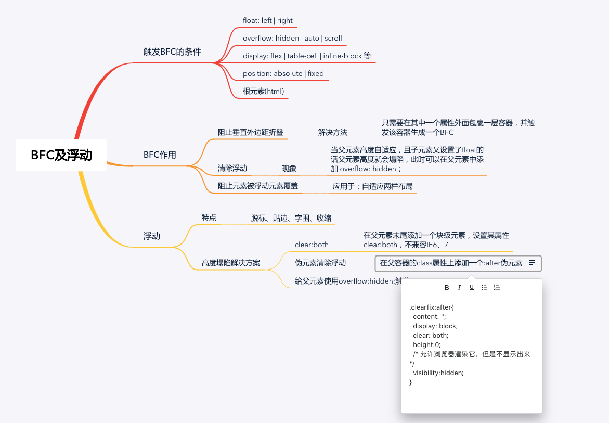
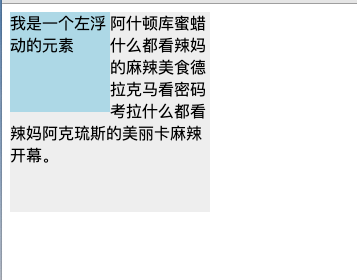
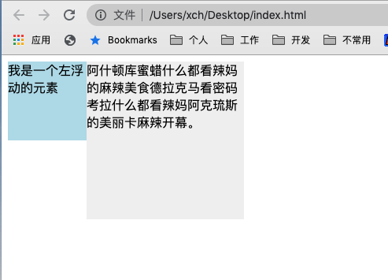

## 一、什么是BFC
> 管理块级元素的容器，它是一个独立渲染的区域，规定了内部的元素如何布局，并保证这个区域和外部互不相干

### 触发BFC的条件
 - float: left | right
 - overflow: hidden | auto | scroll
 - display: flex | table-cell | inline-block 等
 - position: absolute | fixed
 - 根元素(html)

### BFC作用
#### 阻止垂直外边距折叠
```js
<body>
    <p>ABC</p>
    <p>abc</p>
</body>
<style>
p{
  color: #fff;
  background: #888;
  width: 200px;
  line-height: 100px;
  text-align:center;
  margin: 100px;
}
</style>
```
**上面例中两个P元素之间距离本该为200px,然而实际上只有100px,块的下外边距margin-bottom和另一个块的上外边距margin-top会合并为单个边距，哪个大值就是哪个，这个现象叫外边距重叠**
解决方法：
**只需要在p外面包裹一层容器，并触发该容器生成一个BFC**
```js
<body>
    <p>ABC</p>
    <div class="wrap">
      <p>abc</p>
    </div>
</body>
<style>
.wrap{
  overflow:hidden;
}
</style>
```

#### 清除浮动
本来是想把子元素用边框框起来，但是父元素没有高度，一旦子元素设置了float的话就会使得父元素的高度塌陷，我们可以在父元素中添加`overflow: hidden`
```js
.container{
  border: 1px solid red;
}
.cube{
  width: 100px;
  height: 100px;
  background-color: yellow;
  margin: 10px;
  float: left;
}
<div class='container'>
  <div class='cube'></div>
</div>
```

#### 阻止元素被浮动元素覆盖
利用这个特性，我们可以创造**自适应两栏布局**
```js
<style>
.box1{
  height: 100px;
  width: 100px;
  float: left;
  background: lightblue;
}
.box2{
  width: 200px;
  height: 200px;
  background: #eee;
}
</style>
<div class="box1">我是一个左浮动的元素</div>
<div class="box2">阿什顿库蜜蜡什么都看辣妈的麻辣美食德拉克马看密码考拉什么都看辣妈阿克琉斯的美丽卡麻辣开幕。</div>
```


图中出现了文字围绕浮动元素排列现象，如何让浮动元素不影响文字元素呢？
我们可以在.box2样式上添加`overflow:hidden`使其建立一个BFC,让其内容消除对外界浮动元素的影响。



此时左边固定宽度，右边宽度根据内容自适应，这个方法也适用于两列自适应布局

## 二、浮动
### 浮动的特点
 - 脱标、贴边：设置float:left | right 后元素脱离文档流并向对应方向移动，直到它的左边缘碰到包含框的左边缘。
 - 字围：因为脱离文档流后它不再占据空间，实际上覆盖住了框 2，使框 2 从视图中消失。如果框2中有文字，就会围着框1排开
 - 收缩：一个浮动的内联元素（比如span img标签）不需要设置`display：block`就可以设置宽度，一个块级元素设置浮动后，宽度变为内容的宽。

### 浮动会产生父元素高度塌陷问题
父元素高度没有给或者高度自适应，子元素又设置了浮动，那么父元素的高度就没有了。

**解决方案一：clear:both**
> 在父元素末尾添加一个块级元素，设置其属性`clear:both`，不兼容IE6、7
```js
<div class="parent">
    <div class="child"></div>
    <div class="child"></div>
    <div class="child"></div>
    <div style="clear: both;"></div> //新添加的块级元素
    /* 因为clear:botn在IE6、7下不兼容，所以还有一种方案就是用br
     <br clear="all" /> */
</div>
```
**解决方案二：伪元素清除浮动**

给浮动元素的父容器添加一个`clearfix`的class，然后给这个class添加一个`:after`伪元素，实现元素末尾添加一个看不见的块元素来清理浮动。这是通用的清理浮动方案，推荐使用
```js
.clearfix{
  *zoom: 1;/*ie6清除浮动的方式 *号只有IE6-IE7执行，其他浏览器不执行*/
}
.clearfix:after{
  content: '';
  display: block;
  clear: both;
  height:0;
  /* 允许浏览器渲染它，但是不显示出来 */
  visibility:hidden; 
}
<div class="parent clearfix">
    <div class="child"></div>
    <div class="child"></div>
    <div class="child"></div>
</div>
```
**解决方案三：给父元素使用overflow:hidden;触发BFC**

这种方案让父容器形成了BFC（块级格式上下文），而BFC可以包含浮动，通常用来解决浮动父元素高度坍塌的问题。
问题：如果有内容出了盒子，用这种方法就会把多的部分裁切掉，所以这时候不能使用。
```js
.parent{
    border: solid 5px;
    width:300px;
    overflow: hidden;
}
```