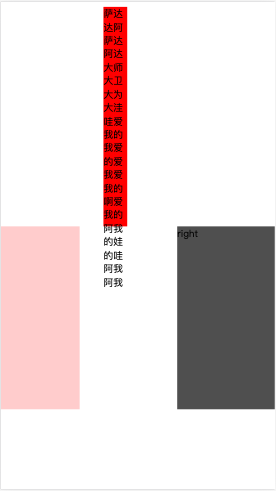

## 一、单列布局
- header,content和footer等宽的单列布局
```js
<div class="header"></div>
<div class="content"></div>
<div class="footer"></div>

.header{
    margin:0 auto; 
    max-width: 960px;
    height:100px;
    background-color: blue;
}
.content{
    margin: 0 auto;
    max-width: 960px;
    height: 400px;
    background-color: aquamarine;
}
.footer{
    margin: 0 auto;
    max-width: 960px;
    height: 100px;
    background-color: aqua;
}
```

## 二、两列自适应布局
```html
<div class="parent" style="background-color: lightgrey;">
    <div class="left" style="background-color: lightblue;">
        <p>left</p>
    </div>
    <div class="right"  style="background-color: lightgreen;">
        <p>right</p>
    </div>        
</div>
```
**一列由内容撑开，另一列撑满剩余宽度的布局方式**

1. float+overflow:hidden
```js
.parent {
  overflow: hidden;
  zoom: 1;
}
.left {
  float: left;
  margin-right: 20px;
}
.right {
  overflow: hidden;
  zoom: 1;
}
```
2. Flex布局
```js
.parent{
  display: flex
}
.right {
  margin-left:20px; 
  flex:1;
}
```

3. grid布局
```js
.parent {
  display:grid;
  grid-template-columns:auto 1fr;
  grid-gap:20px
}
```

## 三、三栏布局
**中间列自适应宽度，旁边两侧固定宽度**

### 1、圣杯布局
> dom结构必须是先写中间列部分，这样实现中间列可以优先加载。
```html
<body>
  <div class="container">
    <div class="center">center</div>
    <div class="left">left</div>
    <div class="right">right</div>
  </div>
</body>

<style>
  .container{
    padding: 0 160px;
  }
  .center, .left, .right {
    float: left;
  }
  .center {
    width: 100%;
    height: 360px;
    background-color: red;
  }
  .left {
    width: 160px;
    height: 300px;
    background-color:#fcc;

    /* 这个值设置很关键 */
    margin-left: -100%;

    position: relative;
    left: -160px;
  }
  .right {
    width: 160px;
    height: 300px;
    background-color: #4f4f4f;

    margin-left: -160px;

    position: relative;
    left: 160px;
  }
</style>
```
实现步骤：
1. 三部分先实现左浮动，中间内容100%，left和right会往下走
2. 设置left内容的`margin-left: -100%`，设置right内容的`margin-left: -160px` ，让三个内容同行显示
3. 设置父容器`padding-left`和`padding-right`，让左右留白
4. 通过设置相对定位，让left和right跑到留白位置
   
注意：
- center中width: 100%不能去掉，虽然在不设置宽度的情况下默认将宽度设置为父元素的100%宽度，但center是浮动元素，设置为float：left之后元素就具有收缩性【看上一章】，在不显式设置宽度的情况下会自动“收缩”到内容的尺寸大小
- 当页面缩放到小于固定宽度时整个页面会错位
  

### 2、双飞翼布局
解决圣杯布局错乱问题
```js
.container {
    min-width: 600px;//确保中间内容可以显示出来，两倍left宽+right宽
}
.left {
    float: left;
    width: 200px;
    height: 400px;
    background: red;
    margin-left: -100%;
}
.center {
    float: left;
    width: 100%;
    height: 500px;
    background: yellow;
}
.center .inner {
    margin: 0 200px; //新增部分
}
.right {
    float: left;
    width: 200px;
    height: 400px;
    background: blue;
    margin-left: -200px;
}
<article class="container">
    <div class="center">
        <div class="inner">双飞翼布局</div>
    </div>
    <div class="left"></div>
    <div class="right"></div>
</article>
```
两者不同：
圣杯布局是利用父容器的左、右内边距+两个从列相对定位；
双飞翼布局是把主列嵌套在一个新的父级块中利用主列的左、右外边距进行布局调整