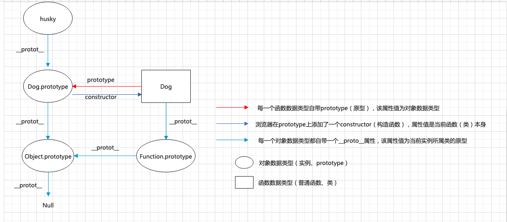
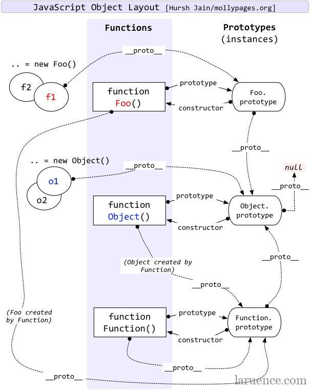

::: slot header

## JavaScript

:::

## 1、构造函数、实例
构造函数：可用来创建特定类型的对象,以一个大写字母开头
```js
function Person() {

}
var person = new Person();
person.name = 'xuech';
console.log(person.name) // xuech

```
> 1、Person既可以称为构造函数也可以称为类
> 
> 2、通过new关键字产生的对象称为实例对象

## 2、构造函数、实例原型、和实例之间的关系
- 每一个构造函数都自带一个prototype（原型）属性，该属性指向函数的【原型对象】
- 每一个实例对象都有一个私有属性__proto__，该属性也指向构造函数的原型对象
  - person.__proto__ === Person.prototype
- 浏览器在prototype上添加了一个constructor属性，该属性值为构造函数本身
  - Person.prototype.constructor === Person



## 3、实例与原型
当读取实例的属性时，如果找不到，就会查找与对象关联的原型中的属性，如果还查不到，就去找原型的原型，一直找到最顶层为止
```js
function Person(name) {
	this.name = name
}
Person.prototype.name = 'Kevin';

var person = new Person('Steve') // 自定义构造函数

console.log(person.name) // Steve

delete person.name;
console.log(person.name) // Kevin
```
当我们删除了 person 的 name 属性时，从私有属性中没有找到name，就会从 person 的原型也就是 person.__proto__ ，也就是 Person.prototype中查找，幸运的是我们找到了 name 属性，结果为 Kevin。如果仍未找到就会从原型的原型中再去找，一直找到Object对象的原型（null）为止。这种关系就称为原型链。


## 4、属性检测
- `in` 操作符：检测属性是否在对象的原型链上
- `hasOwnProperty` 方法：检测属性是否来自对象本身
- `instanceof`：检查一个对象是不是某个类的实例
```js
function Person(name) { 
  this.name = name
}
Person.prototype.getName = function() { 
  return this.name
}
var person = new Person('Steve')

console.log('age' in person)      ==>false
console.log('name' in person)     ==>true
console.log('getName' in person)  ==>true
console.log('toString' in person) ==>true //toString是Object原型上的方法

console.log(person.hasOwnProperty('age'))     ==>false
console.log(person.hasOwnProperty('name'))    ==>true
console.log(person.hasOwnProperty('getName')) ==>false
console.log(person.hasOwnProperty('toString'))==>false
```

## 5、问题
问：为什么实例的constructor也有值？是不是和原型的constructor一样也会指向实例本身？
person.constructor === person ?? false
为什么我打印console.log(person.constructor)是有值的呢？

之所以能打印出这个值，是因为打印的时候，发现person本身并不具有这个constructor属性，通过person.__proto__去原型上找了，找到了prototype.constructor。我们可以用hasOwnProperty看一下就知道了
person.hasOwnProperty(constructor) ==> false

问：如何自己实现一个new？
- 1.创建一个空对象{}
- 2.将构造函数的原型赋值给新创建的对象的原型
- 3.调用构造函数，并将内部this指向新建的对象。而要改变this指向就得使用apply、call方法
- 4.判断构造函数调用的方式，如果是new的调用方式，则返回经过加工后的新对象，如果是普通调用方式，则直接返回构造函数调用时的返回值
```js
function myNew(func, ...args) {
  let obj = Object.create(null)
  obj.__proto__ = func.prototype; 
  let res = func.call(obj, ...args);
  return typeof(res) === 'object'&&res || obj
}
```
