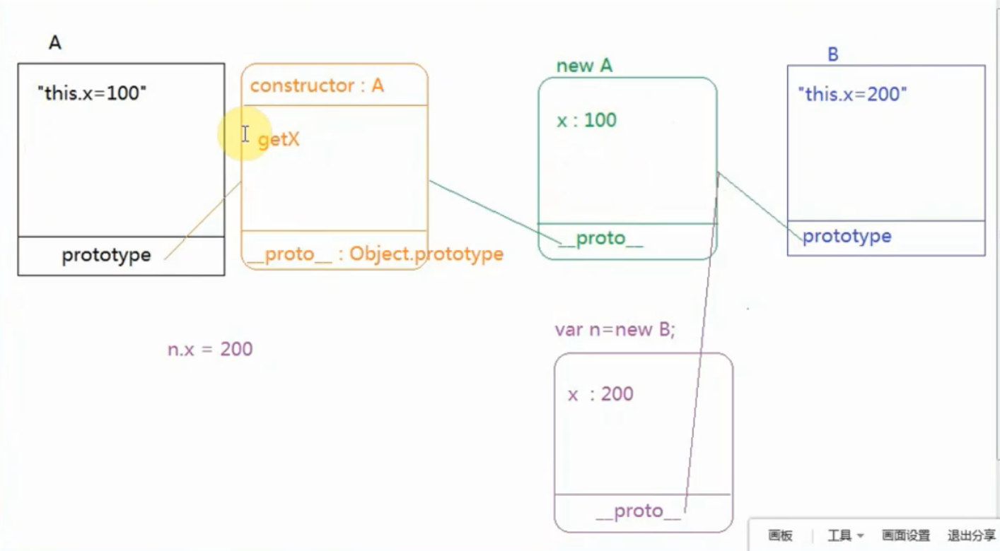

::: slot header

## JavaScript

:::

## 1、原型继承
- 方法：将子类的原型指向父类的实例: `Son.prototype = new Father()`
- 原理：子类在访问属性或调用方法时，往上查找原型链，能够找到父类的属性和方法
- 优点：父类私有和公有的都会继承到子类原型上（子类公有）
- 缺点：
  - 1.原型继承并不是把父类中的属性和方法copy给子类，而是通过原型链接的方式建立起和子类的联系，所以所有子类实例会共享父类的引用属性；
  - 2.在调用子类构造函数时，无法向父类构造函数传递参数
```js
function SuperType(name, info) {
  // 实例属性（基本类型）
  this.name = name || 'Super'
  // 实例属性（引用类型）
  this.info = info || ['Super']
  // 实例方法
  this.getName = function() { return this.name }
}
// 原型方法
SuperType.prototype.getInfo = function() { return this.info }

// 原型继承
function ChildType(message) { this.message = message }
ChildType.prototype = new SuperType('Child', ['Child'])

// 在调用子类构造函数时，无法向父类构造函数传递参数
var child = new ChildType('Hello')

// 子类实例可以访问父类的实例方法和原型方法
console.log(child.getName()) // Child
console.log(child.getInfo()) // ["Child"]

// 所有子类实例共享父类的引用属性
var other = new ChildType('Hi')
other.info.push('Temp')
console.log(other.info) // ["Child", "Temp"]
console.log(child.info) // ["Child", "Temp"]
```


## 2、Call继承
- 方法：在子类的构造函数中调用父类的构造函数，并将this指向子类实例：`A.call(this)`
- 原理：把A当作了一个普通函数，把A中的私有属性和方法copy到子类
- 优点：调用子类构造函数时可以向父类传参，且每个子类的实例都是独立存在互不影响
- 缺点：子类只能访问父类私有属性及方法，因为父类是普通函数也就不存在原型了
```js
function A() {
  this.x = 100
}
A.prototype.getX = function () {
  console.log(this.x);
}
function B() {
  A.call(this)
}

let b = new B()
console.log(b.x);//100
console.log(b.getX); //undefined
```
## 3、冒充对象继承
特点：把父类公有+私有的copy一份给子类私有
```js
function B(){
  var temp = new A
  for(let key in temp) {
    this[key] = temp[key]
  }
  temp = null
}
```
## 4、组合继承
方法：原型继承+Call继承
原理：通过原型继承实现原型属性和原型方法的继承，通过构造继承实现实例属性和实例方法的继承
优点：在调用子类构造函数时，可以向父类构造函数传递参数
优点：子类实例可以访问父类的实例方法和原型方法
优点：每个子类实例的属性独立存在
缺点：在实现组合继承时，需要调用两次父类构造函数
```js
function A() {
  this.x = 100
}
A.prototype.getX = function () {
  console.log(this.x);
}
function B() {
  // 把A当作普通函数
  A.call(this)
}
B.prototype = new A()// 把A当作构造函数
B.prototype.constructor = B
let b = new B()
console.log(b.x);
console.log(b.getX); 
```
## 5、寄生组合继承
组合继承最大的缺点是会调用两次父构造函数。
一次是设置子类实例的原型的时候：`B.prototype = new A()`
另一次是创建子类型实例的时候：`let b = new B()`
在B.prototype和b上都存在x=100这个属性，如何避免这个重复呢？
如果我们不使用 B.prototype = new A() ，而是间接的让 B.prototype 访问到 A.prototype 呢? 
B.prototype = Object.create(A.prototype)

这种方式的高效率体现它只调用了一次 A 构造函数，并且因此避免了在 A.prototype 上面创建不必要的、多余的属性。与此同时，原型链还能保持不变；因此，还能够正常使用 instanceof 和 isPrototypeOf。开发人员普遍认为寄生组合式继承是引用类型最理想的继承范式。

我们来看一段Vue源码中的运用：
```js
function ViewModel(){
    // .....
}
ViewModel.extend = extend
function extend (options) {
    var ParentVM = this
    var ExtendedVM = function (opts, asParent) {
        if (!asParent) {
            opts = inheritOptions(opts, options, true)
        }
        ParentVM.call(this, opts, true)
    }
    // ExtendedVM.prototype继承ParentVM.prototype 
    var proto = ExtendedVM.prototype = Object.create(ParentVM.prototype)
    // prototype的constructor指向构造函数
    utils.defProtected(proto, 'constructor', ExtendedVM) 
    return ExtendedVM
}
```
- ViewModel为父类，ExtendedVM为子类


