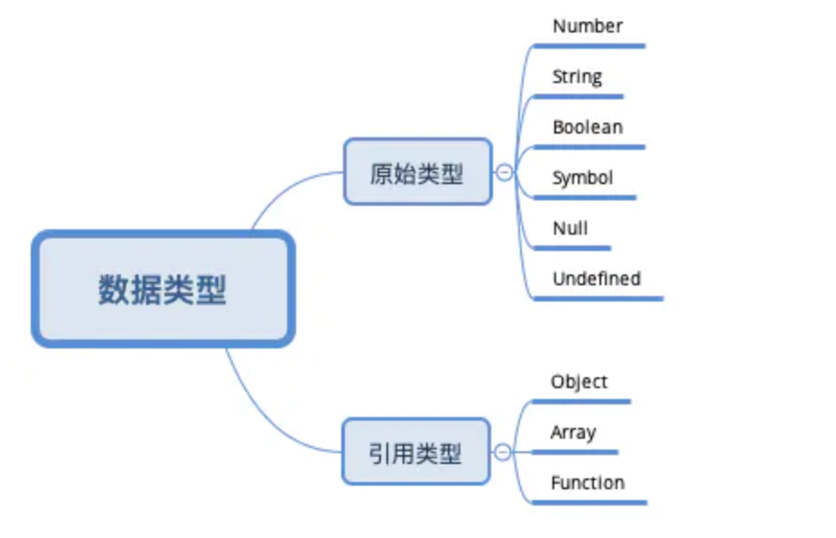
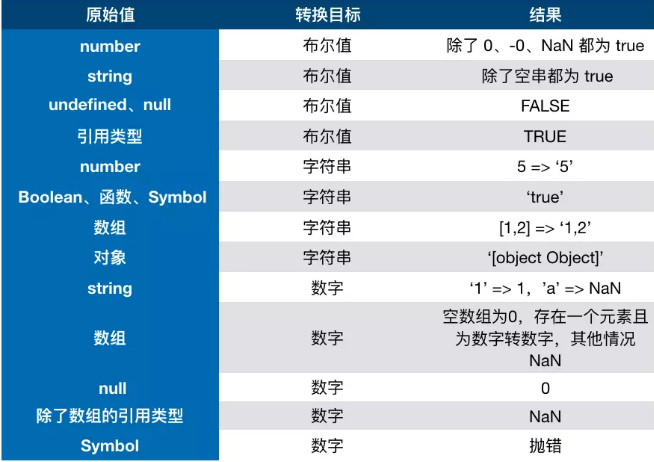

::: slot header

## JavaScript

:::

## 1、数据类型与转化
- 基础数据类型：Number、Null、Boolean、String、Undefined、Symbol
- 引用类型：Object、Array、Function

> 为什么null是基础数据类型？typeof(null) 显示的object啊？
> 
> 首先基础数据类型的值是存放在栈上的，引用类型在栈上只存引用地址，这个地址指向的是堆上的对象，而null的引用地址是空的，所以它只存在于栈上并不对应堆中的任意一个数据

> `null` 和 `undefined` 的区别?
> 
> `null`表示"没有对象"，即该处不应该有值。
> 
> `undefined`表示"缺少值"，就是此处应该有一个值，但是还没有定义，典型的用法：
> 
>（1）变量被声明了，但没有赋值时，就等于undefined。
> 
>（2) 调用函数时，应该提供的参数没有提供，该参数等于undefined。
>
>（3）对象没有赋值的属性，该属性的值为undefined。
>
>（4）函数没有返回值时，默认返回undefined。

出自：[阮一峰undefined与null的区别](http://www.ruanyifeng.com/blog/2014/03/undefined-vs-null.html)

### 类型转化
在 JS 中类型转换只有三种情况，分别是：
- 转换为布尔值
- 转换为数字
- 转换为字符串



### 转Boolean
在条件判断时，除了 undefined， null， false， NaN， ''， 0， -0，其他所有值都转为 true，包括所有对象。

### 对象转原始类型
对象在转换类型的时候，会调用内置的 [[ToPrimitive]] 函数，对于该函数来说，算法逻辑一般来说如下：

- 如果已经是原始类型了，那就不需要转换了
- 调用 x.valueOf()，如果转换为基础类型，就返回转换的值
- 调用 x.toString()，如果转换为基础类型，就返回转换的值
- 如果都没有返回原始类型，就会报错
- 当然你也可以重写 Symbol.toPrimitive ，该方法在转原始类型时调用优先级最高。
```js
let a = {
  valueOf() {
    return 0
  },
  toString() {
    return '1'
  },
  [Symbol.toPrimitive]() {
    return 2
  }
}
1 + a // => 3
```
### 四则运算符
- 运算中其中一方为字符串，那么就会把另一方也转换为字符串
- 如果一方不是字符串或者数字，那么会将它转换为数字或者字符串
```js
1 + '1' // '11' => 特点一
true + true // 2 => 特点二
4 + [1,2,3] // "41,2,3" => 特点二

```

[类型转化1](https://juejin.im/post/6844904149813837838#heading-3)

[类型转化2](https://github.com/mqyqingfeng/Blog/issues/159)

[类型转化3](https://github.com/mqyqingfeng/Blog/issues/164)

[类型转化4](https://github.com/ljianshu/Blog/issues/1)


## 2、类型检测
### 2.1、typeof
> 用于检测一个变量的类型
基础数据类型中除了typeof(null)显示object外其他都能正确判断，但是无法使用 `typeof` 准确判断一个对象的类型。

### 2.2、instanceof
> `instanceof` 用于检测构造函数的 `prototype` 属性是否出现在某个实例对象的原型链上。可以解决 `typeof` 不能准确判断对象类型的问题
> 
> 语法：`object instanceof constructor` ,object：【某个实例对象】，constructor：【某个构造函数】

底层原理：
```js
function myInstanceof(targetObj, targetClass) {
  // 参数检查
  if(!targetObj || !targetClass || !targetObj.__proto__ || !targetClass.prototype){
    return false
  }
  let current = targetObj
  while(current) {   // 一直往原型链上面找
    if(current.__proto__ === targetClass.prototype) return true
    current = current.__proto__
  }
  return false
}

```
测试下：
```js
function Foo(){} 
function BFoo(){} 
Foo.prototype = new BFoo();
console.log(Foo instanceof Function);
console.log(Foo instanceof Foo);
```
### 2.3 Object.prototype.toString()
对于 Object.prototype.toString.call(arg)，若参数为 null 或 undefined，直接返回结果。若参数不为 null 或 undefined，则将参数转为对象，再作判断。对于原始类型，转为对象的方法即装箱
```js
var toString = Object.prototype.toString;

toString.call(new Date); // [object Date]
toString.call(new String); // [object String]
toString.call(Math); // [object Math]

//Since JavaScript 1.8.5
toString.call(undefined); // [object Undefined]
toString.call(null); // [object Null]
toString.call(true); // => "[object Boolean]"
toString.call("");   // => "[object String]"
toString.call([]);   // => "[object Array]"
toString.call(function(){});    // => "[object Function]"
```
问：
Vue源码中为什么要const _toStr = Object.prototype.toString？
[掘金](https://juejin.im/post/6844903732967112717)


**拓展**：下面是几个常用的属性检测函数
### 2.4、hasOwnProperty
> 返回一个布尔值，指示对象**自身属性**中是否具有指定的属性
> 即使属性的值是 null 或 undefined，只要属性存在，hasOwnProperty 依旧会返回 true。
```js
const object1 = {};
object1.property1 = 42;
object1.property2 = null;
console.log(object1.hasOwnProperty('property1')); //true
console.log(object1.hasOwnProperty('toString'));//false
console.log(object1.hasOwnProperty('property2'));//true
```
### 2.5、in
> 会在通过对象能否访问给定的属性时返回true， 无论属性是实例属性还是原型属性

```js
function Person() {
  this.name = 'xch'
}
Person.prototype.sex = 'man'
Person.prototype.age = 18
var person1 = new Person()
console.log('sex' in person1) //true
console.log('age' in person1) //true
console.log('name' in person1) //true
console.log(person1.hasOwnProperty("age")) //false
console.log(person1.hasOwnProperty("name")) //true
```
### 2.6、isPrototypeOf
> 检测一个对象是否是另一个对象的原型。或者说一个对象是否被包含在另一个对象的原型链中
```js
var p = {x:1};//定义一个原型对象
var o = Object.create(p);//使用这个原型创建一个对象
p.isPrototypeOf(o);//=>true：o继承p
Object.prototype.isPrototypeOf(p);//=> true p继承自Object.prototype
```
>调用`isPrototypeOf()`的时候有三种方式
```js
p.isPrototypeOf(o);//=>true
Object.prototype.isPrototypeOf(p);
Animal.prototype.isPrototypeOf(eh)//=>true
```

[参考](https://github.com/ljianshu/Blog/issues/4)

