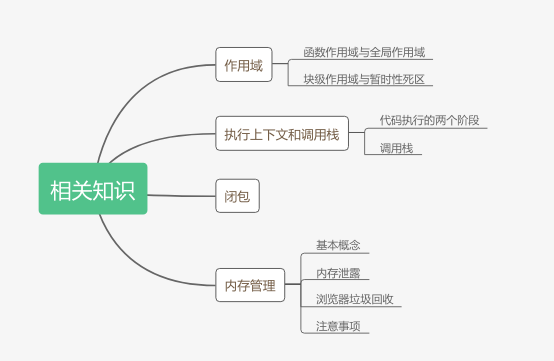

::: slot header

## JavaScript

:::

<!-- 

## 作用域
**本质是在特定场景下如何查找变量的规则** -->


- 作用域其实就是一个变量绑定的有效范围。
- JS使用的是静态作用域，即一个函数使用的变量如果没在自己里面，会去定义的地方查找，而不是去调用的地方查找。去调用的地方找到的是动态作用域。
- var变量会进行申明提前，在赋值前可以访问到这个变量，值是undefined。
- 函数申明也会被提前，而且优先级比var高。
- 使用var的函数表达式其实就是一个var变量，在赋值前调用相当于undefined()，会直接报错。
- let和const是块级作用域，有效范围是一对{}。
- 同一个块级作用域里面不能重复申明，会报错。
- 块级作用域也有“变量提升”，但是行为跟var不一样，块级作用域里面的“变量提升”会形成“暂时性死区”，在申明前访问会直接报错。
- 使用let和const可以很方便的解决循环中异步调用参数不对的问题。
- let和const在全局作用域申明的变量不会成为全局对象的属性，var会。
- 访问变量时，如果当前作用域没有，会一级一级往上找，一直到全局作用域，这就是作用域链。
- `try...catch`的catch块会延长作用域链，往最前面添加一个错误对象。
- with语句可以手动往作用域链最前面添加一个对象，但是严格模式下不可用。
- 如果开发环境支持ES6，就应该使用let和const，不要用var。


## 如何利用闭包实现单例模式
```js
function Person() {
   this.name = 'lucas'
}

const SingleInstance = (function(){
    var singleInstance
   return function() {
        if (singleInstance) {
            return singleInstance
        }
       return singleInstance = new Person()
   }
})()

const instance1 = new SingleInstance()
const instance2 = new SingleInstance()
console.log(instance1 === instance2) // true
```