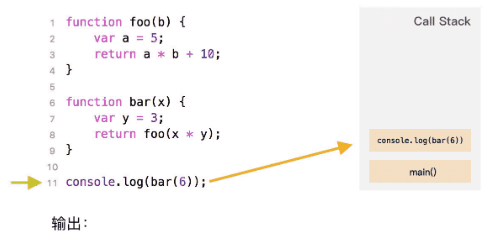

::: slot header

## JavaScript

:::

## 一、执行上下文（Execution Context）
### 1. 什么是执行上下文
> 当前 `JavaScript` 代码被解析和执行时所在环境的抽象概念， `JavaScript` 中运行的所有代码都是在执行上下文中运行

### 2. 执行上下文的类型
- 全局执行上下文： 默认的、最基础的执行上下文。
- 函数执行上下文：每次调用函数时，都会创建一个新的执行上下文。
- Eval函数执行上下文：运行在 eval 函数中的代码也获得了自己的执行上下文【不常用】

## 二、执行上下文的生命周期
### 1. 创建阶段
**函数被调用，但未执行内部代码之前，会做以下三件事**
- 创建变量对象(VO)：形参赋值，提升函数声明和变量声明
- 创建作用域链(Scope)：作用域链是在变量对象之后创建的
- 确定this指向：[第四篇](4.md)

### 2. 执行阶段
执行变量赋值、代码执行

### 3. 回收阶段
执行上下文出栈等待虚拟机回收执行上下文


## 三、变量声明提升和函数声明提升
> 当遇到函数和变量同名且都会被提升的情况，函数声明优先级比较高，因此变量声明会被函数声明所覆盖，但是可以重新赋值。
```js
function test(arg){
  // 1. 形参 arg 是 "hi"
  // 2. 因为函数声明比变量声明优先级高，所以此时 arg 是 function
  console.log(arg);  
  var arg = 'hello'; // 3.var arg 变量声明被忽略， arg = 'hello'被执行
  function arg(){
    console.log('hello world') 
  }
  console.log(arg);  
}

test('hi');
/* 输出：
function arg(){
  console.log('hello world') 
}
hello 
*/
```
- test函数执行，形成一个新的私有作用域
- 如果有形参，先给形参赋值
- 私有作用域中开始预解释，函数声明优先级比变量声明高，最后后者会被前者所覆盖，但是可以重新赋值
- 私有作用域中的代码从上到下执行

## 四、执行上下文栈（Execution Context Stack）
`JavaScript` 引擎创建了**执行上下文栈**来管理执行上下文。可以把执行上下文栈认为是一个存储函数调用的栈结构，遵循先进后出的原则。


- JavaScript执行在单线程上，所有的代码都是排队执行。
- 一开始浏览器执行全局的代码时，首先创建全局的执行上下文，压入执行栈的顶部。
- 每当进入一个函数的执行就会创建函数的执行上下文，并且把它压入执行栈的顶部。当前函数执行完成后，当前函数的执行上下文出栈，并等待垃圾回收。
- 浏览器的JS执行引擎总是访问栈顶的执行上下文。
- 全局上下文只有唯一的一个，它在浏览器关闭时出栈。

我们以下面的代码来解释执行上下文及执行上下文栈的关系变化：
```js
var scope = "global scope";
function Fn(){
    var scope = "local scope";
    function f(){
        return scope;
    }
    return f();
}
Fn();
```
1. 执行全局代码，创建全局执行上下文，并被压入执行上下文栈： `ECStack = [ globalContext]`
2. 全局上下文初始化：
```js
globalContext = {
    VO: [global],
    Scope: [globalContext.VO],
    this: globalContext.VO
}
```
3. 初始化的同时，Fn 函数被创建，保存作用域链到函数的内部属性[[scope]]: `Fn.[[scope]] = [globalContext.VO]`
4. 执行Fn函数，创建Fn函数执行上下文，Fn函数执行上下文被压入上下文栈：
`ECStack = [FnContext, globalContext]`
5. Fn 函数执行上下文初始化：
   1. 复制函数 [[scope]] 属性创建作用域链，
   2. 用 arguments 创建活动对象，
   3. 初始化活动对象，即加入形参、函数声明、变量声明，
   4. 将活动对象压入 Fn 作用域链顶端。
同时 f 函数被创建，保存作用域链到 f 函数的内部属性[[scope]]
```js
FnContext = {
        AO: {
            arguments: {
                length: 0
            },
            scope: undefined,
            f: reference to function f(){}
        },
        Scope: [AO, globalContext.VO],
        this: undefined
    }
```
6. 执行 f 函数，创建 f 函数执行上下文，f 函数执行上下文被压入执行上下文栈
```js
ECStack = [
    fContext,
    FnContext,
    globalContext
];
```
7. f 函数执行上下文初始化, 以下跟第 5 步相同：
   1. 复制函数 [[scope]] 属性创建作用域链 
   2. 用 arguments 创建活动对象
   3. 初始化活动对象，即加入形参、函数声明、变量声明
   4. 将活动对象压入 f 作用域链顶端
```js
fContext = {
    AO: {
        arguments: {
            length: 0
        }
    },
    Scope: [AO, FnContext.AO, globalContext.VO],
    this: undefined
}
```
8. f 函数执行，沿着作用域链查找 scope 值，返回 scope 值
9. f 函数执行完毕，f 函数上下文从执行上下文栈中弹出
```js
ECStack = [
    FnContext,
    globalContext
];
```
10. Fn 函数执行完毕，Fn 执行上下文从执行上下文栈中弹出
```js
ECStack = [
    globalContext
];
```

[参考：冴羽](https://github.com/mqyqingfeng/Blog/issues/8)

[参考：jsl](https://github.com/ljianshu/Blog/issues/60)

