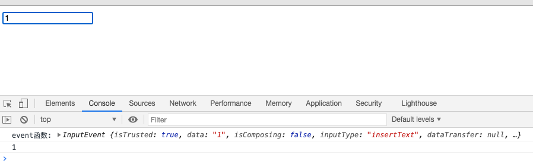
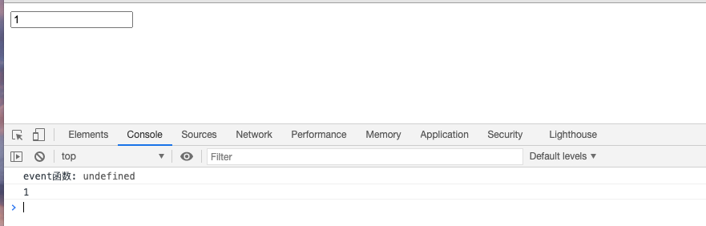
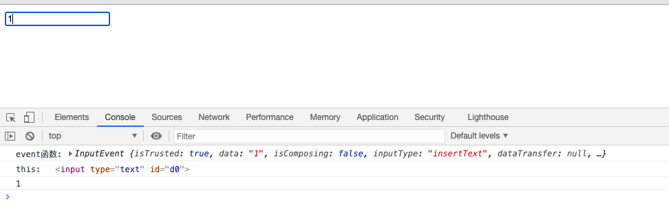

::: slot header

## JavaScript

:::

## 防抖与节流
### 防抖
> 规定在事件触发的N秒后开始执行，N秒内再次触发事件的，以新触发事件的时间为起点重新开始计算，至到N秒到后执行。
> 我们上下班做电梯时如果你一直按着楼层不放手，电梯门就一直不关，5秒后没人按电梯键后电梯门自动关闭
> input输入框中输入结束后调用查询接口，在规定的时间内有输入的话就不调接口
以输入框为列：
```js
<input type="text" id='input'/>
<script>
  var input = document.getElementById('input')
  input.oninput = function () {
    console.log(input.value);
  }
</script>
```
以上代码每次输入一个字符就会触发一次打印，如果是ajax请求的话就比较耗性能了，我们尝试加入防抖功能，
```js
function debounce(func, awit) {
  var timer = null;
  return function () {
    clearTimeout(timer);
    timer = setTimeout(func, awit)
  }
}

function getUserAction(){
  console.log(this)
  console.log(input.value);
}
input.oninput = debounce(getUserAction, 1000)
```
这样的话当我们1S后没有输入时就会触发打印函数

问题：
1. this指向问题
   如果我们在 `getUserAction` 函数中 `console.log(this)`，在不使用 `debounce` 函数的时候，`this` 的值为：`<input type="text" id='input'/>`,但是如果使用我们的 `debounce` 函数，`this` 就会指向 `Window` 对象！
2. event对象
   JS的事件处理函数中默认会提供事件对象`event` 
   
   但是使用了`debounce` 函数时只打印`undefined`
   
解决上面2问题，我们需要对 `debounce` 函数重写改写下：
```js
function debounce(func, awit) {
  var timer = null;
  return function () {
    var context = this;
    var args = arguments;
    clearTimeout(timer);
    timer = setTimeout(function(){
      func.apply(context, args)
    }, awit)
  }
}
```


### 立即执行
需求：

## 浅拷贝实现方法？手写深拷贝
## 手写bind，apply，call函数
