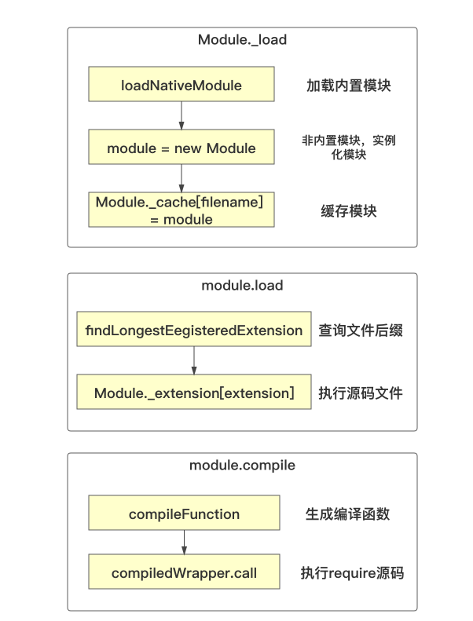
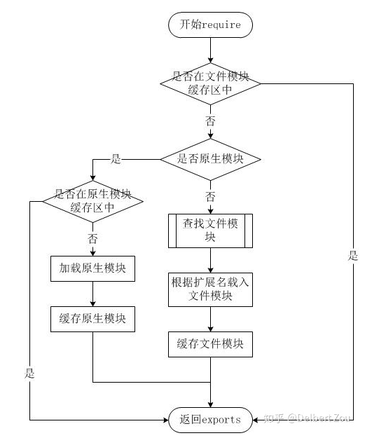

# require源码解析

## 加载模块的类型
- 内置模块：`require('fs')`
- 加载第三方模块：`require('axios')`
- 加载自定义模块：`require('./utils')`

## 支持文件类型
- 加载`.js`文件
- 加载`.json`文件
- 加载`.node`文件
- 加载`.mjs`文件
- 加载其他文件 

## 思考
- `CommonJS` 模块的加载流程
  - 优先加载内置模块，即使有同名文件，也会优先使用内置模块
  - 不是内置模块，先去缓存找
  - 缓存没有就去找对应路径的文件
  - 不存在
- `require`如何加载内置模块
- `require`如何加载`node_modules`模块
- `require`为什么会将非`js/json/node`文件视为js文件加载

## 思考：commonjs模块可以进行`tree-shaking`吗？为什么？
`es6_modules` 可以在编译时进行分析，所以它是静态模块，当然就可以
`tree-shaking`，而commonjs模块在代码执行时才引入模块属于动态模块，它就不支持`tree-shaking`

## 思考：requrie在处理文件路径是为什么是绝对路径而不是相对路径？
不用文件夹下可能会有同名文件，为了保障模块的唯一性只有通过绝对路径

## require加载顺序
- 调用`Module._load`，最终返回`module.exports`
  - 在`Module._load`方法中调用`Module._resolveFilename`
  - 在`Module._resolveFilename`中调用`Module._findPath`解析文件名，并将文件名变成**绝对路径**
- `Module._cache`：是否有缓存文件
- `new Module`对象，包含二个重要字段，id（文件绝对路径），exports
  - 创建对象完成后，将对象缓存起来：`Module._cache[filename] = module`
- 调用`tryModuleLoad`方法，执行`module.load(filename)` 尝试加载模块
- module.paths: 包含该文件的所有路径组成的数组
- 获取文件扩展名并根据扩展名调用对应方法`Module.extensions`（策略模式）
- `fs.readFileSync(filename, 'utf8')`读取文件内容
- 调用`module._compile`方法
  - 使用`Module.wrap`对文件内容进行包装
  - 使用`vm.runInThisContext`方法对包装的内容进行处理得到真正的函数
- 将用户的内容包装到一个函数中 (function (exports,require,module. __filename,__dirname){})




```js
// use 
const add = require('./add.js')
```

找到add.js并且拿到里面的内容

```js
// a.js
const a = '123'
module.exports = a
```
将拿到的内容放入给定的方法中，并且返回`modue.exports`：
```js
(function (exports,require,module. __filename,__dirname){
  const a = '123'
  module.exports = a

  return modue.exports
})
```

这样我们在use页面其实就是下面的函数：
```js
const add = (function (exports,require,module. __filename,__dirname){
  const a = '123'
  module.exports = a

  return modue.exports
})

```
这样add就是a了

## 手写require方法《简单版》
[Github](https://github.com/xuech/requireJS)
