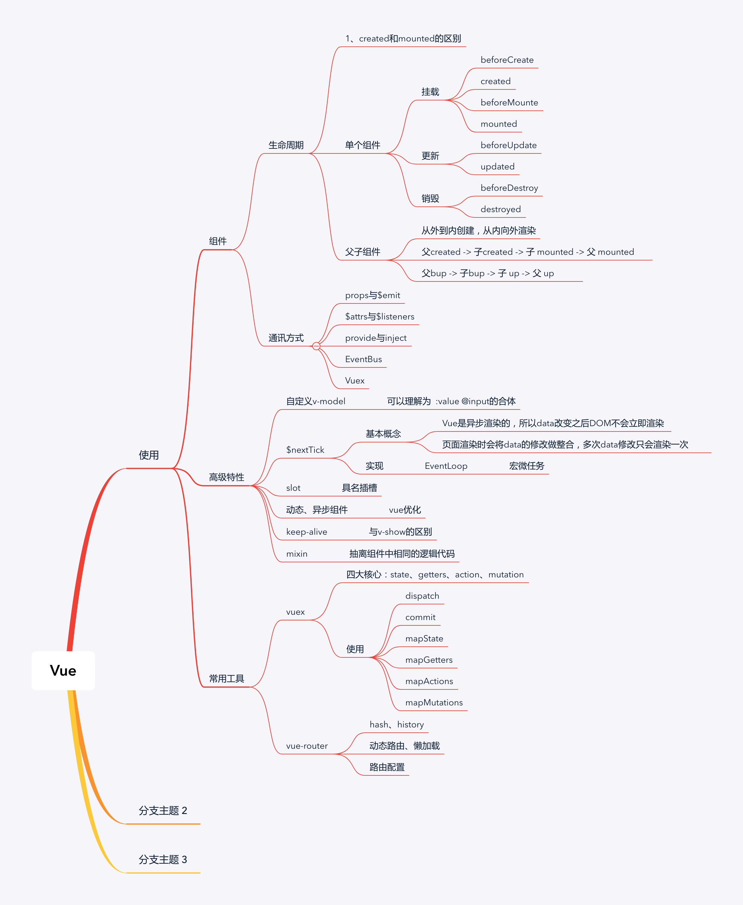

## 组件
### 父子组件的生命周期及调用顺序
- 单个组件
	1. 挂载
		- `beforeCreate`
		- `created`
		- `beforeMounte`
		- `mounted`
	2. 更新
		- `beforeUpdate`
		- `updated`
	3. 销毁
		- `beforeDestroy`
		- `destroyed`
- 父子组件
	- 从外到内创建，从内向外渲染
	- 父beforeCreate->父created->父beforeMount->子beforeCreate->子created->子beforeMount->子mounted->父mounted
	- 父bup -> 子bup -> 子 up -> 父 up

### 组件间通信的方式
- `v-bind` 和 `props` （通过绑定属性进行传值）         父 -> 子
- `v-on` 和 `$emit` （通过触发事件进行传值）           子 -> 父
- `$ref、$parent、$children`（通过获取到dom进行传值）  
- `provide`和`inject` （使用依赖注入进行传值）         父 -> 孙
- `$attrs` 和 `$listeners` (获取剩余参数进行传值)     父 -> 孙/子
- `EventBus` (利用事件总线进行传值)                   兄 -> 兄
- `vuex` （利用 `vuex` 插件进行传值）                 
- 利用本地存储和`vue-router`等方式 

### 异步组件
> 按需加载，异步加载大组件
```js
components: {
  HelloWorld:() => import('./components/HelloWorld.vue')
},
```

### 动态组件
```js
<component :is="dt"/>
import Xinput from './components/Xinput.vue'
data() {
  return {
    dt: 'Xinput'
  }
},
```
一般用在图文混排的列表页面中，因为你不知道出现的文章格式是什么样子的
当然也可以用v-if来实现

问：
- v-if和v-show及动态组件的区别？
- v-if和v-for的优先级？
  - 在 vue 2.x 中，在一个元素上同时使用 `v-if` 和 `v-for` 时，`v-for` 会优先作用。
  - 在 vue 3.x 中，`v-if` 总是优先于 `v-for` 生效。
  - 最佳做法，把过滤放在`computed`里面

### 与keep-alive结合使用
> 缓存组件，一般在频繁切换且不需要重复渲染的情况下使用
与v-show的区别

## Vue.$nextTick
> 修改页面数据后立即调用该方法才能获取更新后的DOM
```js
<template>
  <div id="app">
    <ul v-for="it in list" ref="ullist">
      <li>{{it}}</li>
    </ul>
    <button @click="updateMessage">点我</button>
  </div>
</template>

data() {
  return {
    list: [1,2,3]
  }
},
methods: {
  updateMessage: async function () {
    this.list.push(4)
    await this.$nextTick()
    //上面注释掉时页面上显示1，2，3，4，但是DOM数据并没有更新
    console.log(this.$refs.ullist);
  }
}
```
没有调用`await this.$nextTick()`时
[1.0](imgs/1.0.png)

## mixin
> 对有相同逻辑的多个组件进行抽离

问题：
- 可读性差
- 可能造成命名冲突

## vuex
四大核心：`state、getters、action、mutation`

## vue-router
- 路由模式： hash、history
- 路由配置：动态路由、懒加载

## vue原理
- 组件化
  - 数据驱动试图
  - MVVM
- 响应式
  - `Object.defineProperty`与`Proxy`
- 模版编译
- 渲染过程
- vdom和diff
- 前端路由