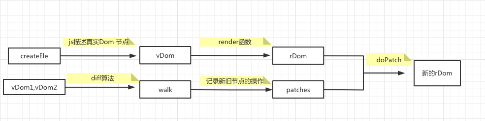

1. createElement函数：返回一个描述vdom的js对象
2. render函数：虚拟节点转真实DOM
3. diff函数：用来比较2个vdom对象具体不同，形成一个描述对象（描述2个vdom的不同点）
4. patch函数：将差异应用到真实的 DOM 树上
  
## vdom
> 用js模拟DOM结构，计算出最小变更，操作DOM，把DOM的操作转为JS的操作
> 存在价值：数据驱动视图，控制DOM操作
```js
<script>
<div id="div1" class="container">
  <p>vdom</p>
</div>
转译过后的dom
{
  tag: 'div',
  props: {
    id: 'div1',
    className: 'container' 
  },
  children: [
    {
      tag: 'p',
      children: 'vdom'
    }
  ]
}
```

## `vdom.js`
### 构建虚拟节点
> 通过类的实例化将传入的dom元素信息对象化，此时就构成了虚拟节点
  - createElement(type,props,children)
  ```js
  //构造函数
  class Element {
    constructor(type, props, children) {
      this.type = type;
      this.props = props;
      this.children = children;
    }
  }

  function createElement(type,props,children){
    return new Element(type,props,children);
  }
  ```
### 转化真实节点
  - render(vdom)
### 渲染DOM节点
  - renderDom(rDom, document.getElementById('app'))
  
## `diff.js`

### 新旧阶段差异分析并获取补丁包
  - 使用深度优先算法进行比较
  - 得到新节点的操作记录，【增、删、改、换】
  - diff算法具体流程：
    1. 拿到新旧vdom
    2. 如果不存在新dom，则得到 'REMOVE' 类型的操作记录
    3. 如果不存在旧dom，则得到 'ADD' 类型的操作记录
    4. 如果新旧节点类型为字符串且文本不相同，则得到 'TEXT'类型的操作记录
    5. 如果新旧节点类型相同，通过递归调用得到所有子节点的操作记录
    6. 剩余则为'REPLACE'类型的替换操作记录 
    
## `patch.js`
### 给创建好的真实dom打补丁
  - 循环补丁包，补丁类型设置相应的操作

## 虚拟dom的缺点
- 首次渲染大量DOM时，由于多了一层DOM计算，会比原生innerHTML方法插入慢
- 虚拟DOM需要在内存中维护一份DOM的副本
- 适合频繁DOM更新的场景

代码在GitHub: [源码](https://github.com/xuech/vue-vdom)

学习资料: [b站](https://www.bilibili.com/video/BV1zk4y1y7sD)
[个人](https://juejin.cn/post/6877142396967223304)
[全面](https://juejin.cn/post/6844904078196097031)
