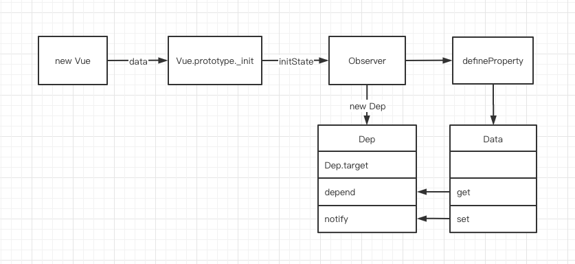
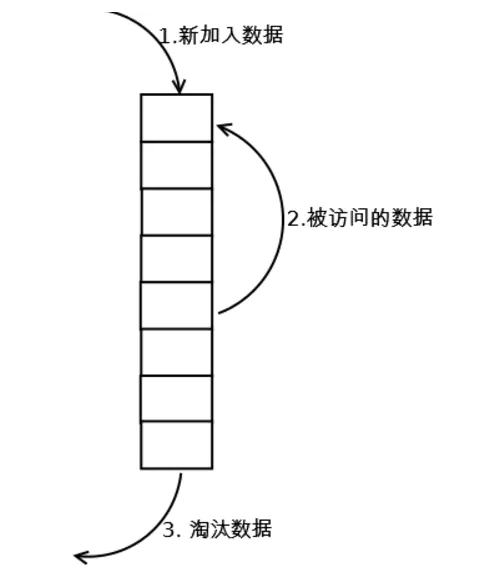

 
## 1、什么是发布/订阅模式、观察者模式？
## 2、如何理解Vue2响应式原理？
- 响应式： `defineProperty`
  - 缺点：深度监听、需递归到底、一次性计算量大
  - 无法监听新增删除属性，需使用`Vue.set`、`Vue.delete`方法
  - 无法原生监听数组，需对原型进行劫持
## 3、vue 的数据驱动原理及如何实现？


> 【Observer与Dep的关系】通过`Observer`构造函数下的`Object.defineProperty`方法劫持属性的`setter`和`getter`方法，并创建了用于依赖收集的`Dep`对象
> 
> 【Dep与Watcher的关系】当数据触发get查询时将当前的 `Watcher` 加入到依赖收集池 `Dep` 中；当数据变动时触发`setter`通知之前依赖收集得到的 `Dep` 中的每一个 `Watcher`，告诉它们自己的值改变了，需要重新渲染视图。这时候这些 `Watcher`就会开始调用 `update` 来更新视图。

[参考](https://juejin.cn/post/6857669921166491662)

[参考](https://juejin.cn/post/6896777102369456142)

### 缺点：
- `Object.defineProperty`的缺点:
  1. 对于庞大的对象需要一次性递归到底，效率低
  2. 无法监听新增或删除属性
     - 设置`Vue.$set`、`Vue.$delete`
  3. 无法原生监听数组
     - 对数组进行原型链重写，指向自己定义的数组原型方法
  ```js
  // 创建一个原型指向Array.prototype的对象
  const arrProto = Object.create(Array.prototype) 
  const methods = ['push', 'pop', 'splice']
  // 重新定义这些数组方法
  methods.forEach(method => {
      arrProto[method] = function (...args) {
          console.log('更新视图！') // 在这里更新视图
          Array.prototype[method].apply(this, args)
      }
  })
  // 修改defineReactive函数
  defineReactive (data, key, val) {
      this.observe(val)
      // 监听数组，更换新原型
      if (Array.isArray(value)) {
          value.__proto__ = arrProto
      }
  }
  ```
[参考](https://juejin.cn/post/6857669921166491662)

## 4、vdom和diff？
见3

## 5、vue的模版编译
- with语法
- 模版编译 => render函数
- 执行 render 函数 => vnode
## 6、描述组件渲染和更新过程，为什么是异步渲染？
### 初次渲染的过程
- 解析模版为`render`函数
- 触发响应式，监听data属性`getter setter`
- 执行`render`函数，生成`vnode`， patch（elem、vnode）

### 更新过程
- 修改data、触发`setter`
- 重新执行`render`函数，生成`newVnode`
- patch(vnode、newVnode)

### 异步渲染
nextTick 的原理以及运行机制
见2

## 7、前端路由原理
- hash特点
  - hash变化会触发页面跳转，即浏览器的前进后退
  - hash变化不会刷新页面
  - hash变化不会提交到server端
- history
  - 也不会刷新页面（history.pushState、window.onpopstate）
  - 需服务端支持，在路径找不时返回index页面而不是404

## 8、Vue-Router 有几种钩子函数，执行流程是怎样的？
- 全局守卫(`beforeEach`和`aftrEach`)
  - 三个参数(to,from,next),`afterEach`函数不用传`next()`函数
  - 一般用来判断权限等操作
- 路由守卫(`beforeEnter`，`beforeleave`)
  - 路由跳转时需要执行的逻辑
- 组件守卫(`beforeRouteEnter，beforeRouteUpdate,beforeRouteLeave`)

路由解析流程：
1. 导航被触发
2. 在失活的组件里调用`beforeRouteLeave`守卫
3. 调用全局的`beforeEach`守卫
4. 在重用的组件里调用`beforeRouteUpdate` 守卫
5. 在路由配置里调用`beforeEnter`
6. 解析异步路由组件
7. 在被激活的组件里调用`beforeRouteEnter`
8. 调用全局的`beforeResolve`守卫
9. 导航被确认
10. 调用全局的`afterEach`钩子
11. 触发DOM更新
12. 调用`beforeRouteEnter`守卫传给next的回调函数，创建好的组件实例会作为回调函数的参数传入。
## 9、聊聊keep-alive 的实现原理和缓存策略
`keep-alive` 组件接收三个参数，分别为 `include、exclude、max`
- `include` - 数组、字符串或正则表达式。只有名称匹配的组件会被缓存。
- `exclude` - 数组、字符串或正则表达式。任何名称匹配的组件都不会被缓存。
- `max` - 数字。最多可以缓存多少组件实例。 
### 实现原理
组件创建时，新建缓存节点，按序保存key，通过传入的`include、exclude`判断是否命中缓存，命中则从缓存中出vnode实例，否则，加入缓存，判断是否超出最大缓存数量，是，则删除最久未使用节点（LRU）
组件一旦被缓存，再次渲染时将不会调用`created`和`mounted`函数，如要在缓存组件再次渲染时进行操作的话可以在`activated`和 `deactivated` 函数中
### 缓存策略（LRU）
> 从内存中找出最久未使用的数据置换新的数据，类似【手机后台任务】
1. 新数据插入到链表头部；
2. 每当缓存命中（即缓存数据被访问），则将数据移到链表头部；
3. 链表满的时候，将链表尾部的数据丢弃；
  


**代码实现**

[代码](https://github.com/xuech/learning/tree/master/LRU)

[leetcood](https://leetcode-cn.com/problems/lru-cache/solution/lruhuan-cun-ji-zhi-by-leetcode-solution/)


## 12、优化
- 如果一个组件是纯展示且不需要有响应式数据状态的处理的可以使用函数式组件(无状态组件)替换， `functional: true`
  - 无需维护响应数据
  - 无钩子函数
  - 没有`instance`实例,组件内部没有办法像传统组件一样通过this来访问组件属性

- 数据层级不易过深，合理设置响应式数据
  - 底层利用递归进行依赖收集

- 合理使用`v-if`与`v-show`
  1. 手段：v-if是动态的向DOM树内添加或者删除DOM元素；v-show是通过设置DOM元素的display样式属性控制显隐；
  2. 编译条件：v-if是惰性的，如果初始条件为假，则什么也不做；只有在条件第一次变为真时才开始局部编译；v-show 在任何条件下都会渲染。
  3. 性能消耗：v-if有更高的切换消耗；v-show有更高的初始渲染消耗；
  4. 使用场景：v-if适合运营条件不大可能改变；v-show适合频繁切换。
  5. 注意点：当一个元素默认在css中加了display：none属性，这时通过v-show修改为true是无法让元素显示的。原因是显示隐藏切换，只是会修改element style为display:""或者display:none,并不会覆盖掉或修改已存在的css属性。

- mixin


## 14
keep-alive

12-16
[MVVM](https://juejin.cn/post/6844904149239201800)

12-17
宏微任务
https://github.com/zachrey/zblog
12-18


面试时简历亮点：
小程序扫描二维码上传到pc
[二维码扫描登录原理](https://www.cnblogs.com/mq0036/p/12613286.html)
