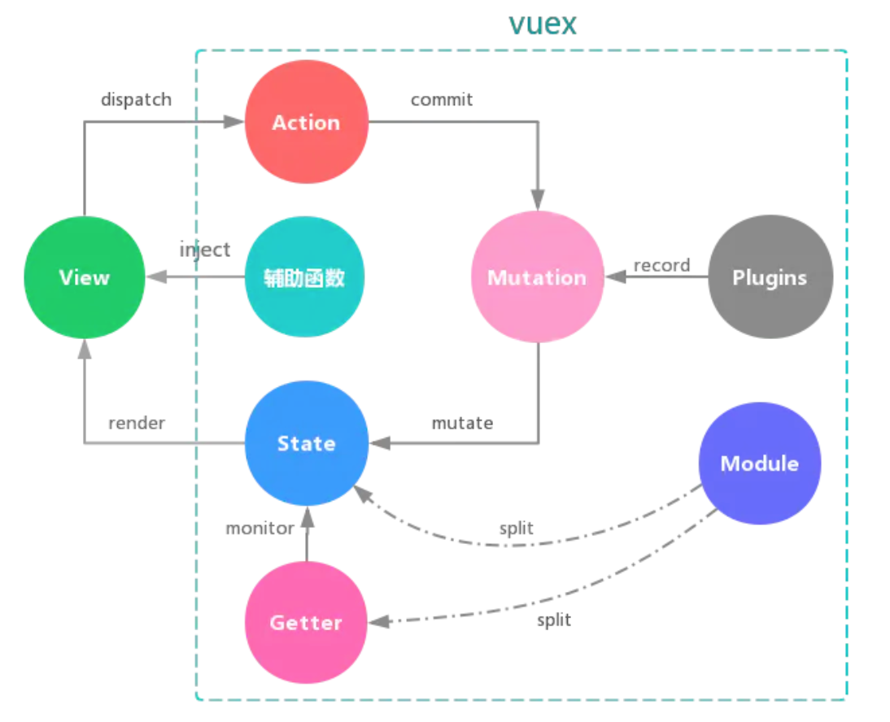
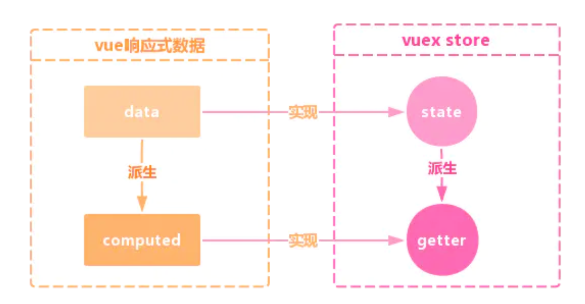

## vuex的构成
vuex是vue的状态管理器，它由以下五个部分组成：
- `State` 、`Getter` 对状态进行定义
- `Mutation` 对状态进行变更
- `Action` 用于提交 mutation，而不是直接变更状态，可以包含任意异步操作
- `Modules` 对状态进行模块化分割
- `plugins` 对状态进行持久化存储、追踪等
- `mapState、mapGetters、 mapActions、 mapMutations` 进行便利化操作


## vuex的store是如何注入到组件中的？
当我们使用vuex时，需要进行以下代码的书写，
`Vue.use(Vuex); `而这段代码的本质其实就是`Vue.mixin({ beforeCreate: vuexInit });`

```js
 /*Vuex的init钩子，会存入每一个Vue实例等钩子列表*/
  function vuexInit () {
    const options = this.$options;
    if (options.store) {
      //根实例
      this.$store = options.store;
    } else if (options.parent && options.parent.$store) {
      //子组件， 父组件存在并且有store属性
      this.$store = options.parent.$store;
    }
  }
```

> 每个vue组件实例化过程中，会在 `beforeCreate` 钩子前调用 `vuexInit` 方法

**vuex利用了vue的mixin机制，在 beforeCreate 钩子函数中 将store注入到vue组件实例上，并注册了 vuex store的引用属性 $store！**

## vuex的state 和 getter 是如何映射到各个组件实例中自动更新的呢？
- vuex的state是借助vue的响应式data实现的。
- getter是借助vue的计算属性computed特性实现的



[参考文章](https://juejin.cn/post/6844903507057704974#heading-0)
[面试题](https://juejin.cn/post/6844903993374670855)