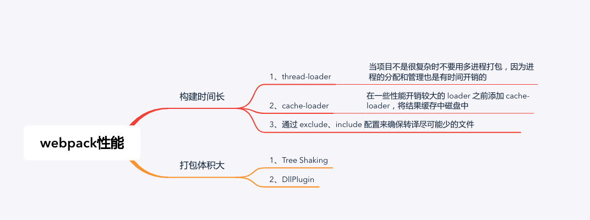

## Webpack构建流程
- 根据配置，从Entry开始，递归解析Entry依赖的所有Module，每找到一个Module，就会根据Module.rules里配置的Loader规则进行相应的转换处理；
- 对Module进行转换后，这些Module会以Entry为单位进行分组，即为一个Chunk。因此一个Chunk，就是一个Entry及其所有依赖的Module合并的结果。
- 在整个构建流程中，Webpack会在恰当的时机执行Plugin里定义的逻辑，从而完成Plugin插件的优化任务。
- 将所有的Chunk转换成文件输出Output。

1. 初始化参数
   解析配置参数，合并`vue.config.js`文件配置的参数，得到最后配置结果
2. 开始编译
   将得到的参数初始化为`compiler`对象，注册`Plugin`，插件监听`Webpack`构建生命周期的事件节点,执行对象的 run 方法开始执行编译
3. 确定入口
   从`entry`开始解析文件构建`AST`语法树，找出依赖，递归遍历
4. 编译模块
   递归中根据文件类型和`loader`配置，调用所有配置的`loader`对文件进行转换，再找出该模块依赖的模块  
5. 完成模块编译并输出
   递归完后，得到每个文件结果，包含每个模块以及他们之间的依赖关系，根据 `entry` 配置生成代码块 `chunk` 。
6. 输出完成
   将所有的`chunk`转换成文件输出到`output`

